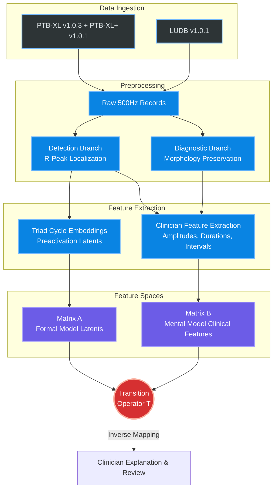

# Transition Matrix ECG (tm-ecg)


> **Implementation Specification for Explainable ECG Arrhythmia Analysis with Clinician-Facing Feature Matrices, Reduced-Rank Latent Spaces, and Regularized Transition Operators.**

[](https://www.python.org/downloads/)
[](https://opensource.org/licenses/MIT)

## 📌 Overview

`transition-matrix-ecg` is a locked baseline implementation for explainable ECG arrhythmia analysis. It connects complex, formal Deep Learning models (the latent space) to a transparent, clinician-understandable mental model (the feature space) using a mathematical bridge known as a **Transition Matrix**.

This repository contains a package-oriented research pipeline scaffold that strictly follows the implementation-grade research blueprint defined in [`AGENTS.md`](./AGENTS.md).

## 🚀 Key Scientific Backbone

The pipeline is built upon an escalating program of research:

1. **Domain Knowledge Integration**: Adaptive-window, knowledge-integrated R-peak detection.
2. **Cycle-Centered Representation**: Arrhythmia classification based on a **triad of cardio cycles** (preceding, current, following).
3. **Clinician-Facing B-Matrices**: A structured clinical reasoning surface (`B_raw` and `B_fit`) built from amplitudes, durations, RR context, and waveform fragments.
4. **Regularized Transition Operator**: A reduced-rank ridge transition operator linking the deep latent space (Matrix `A`) directly to the expert clinical features (Matrix `B`).

## 🏗️ System Architecture



## 📁 Repository Structure & Deliverables

The pipeline generates several critically important artifacts, heavily relying on the following tracked directories:

* **[`features/`](./features/)**: Contains the materialized benchmark (`B1`) and gold-standard (`B2`) matrices in `.parquet`, `.csv`, and `.xlsx` formats.
  * `B1_raw_train` (10,000 row benchmark)
  * `B_fit` (Typed transform spaces for modeling)
* **[`reports/`](./reports/)**: Documentation explaining feature formulations, data mappings, and matrix structures.
  * [B-Matrix Generation Report](./reports/b_matrix_generation_report.md)
  * [B1 Raw Train Feature Null-Count Report](./reports/b1_raw_train_null_report.md)
* **[`data_lock/`](./data_lock/)**: The designated secure, version-locked storage for the original ECG `.zip` dataset archives. See the [Data Lock README](./data_lock/data_lock_readme.md) for strict reproducibility guidelines.
* **`manifests/`**: Project ontology and source checksums.
* **`src/tm_ecg/`**: The core execution pipeline, models, and transition operator math.
* **`AGENTS.md`**: The supreme governing specification for this implementation.

*(Note: Heavy training outputs like `raw/`, `interim/`, `latents/`, and `transition/` are intentionally git-ignored).*

## ⚡ Quick Start

Heavy training and full dataset processing are deferred until the scientific Python stack is installed. To run the entrypoints:

1. Review the defaults in `configs/defaults.toml`.
2. Use an editable install or set `PYTHONPATH=src`.
3. **Bootstrap the environment**:

    ```powershell
    $env:PYTHONPATH = "src"
    python -m tm_ecg.cli bootstrap-env
    ```

4. **Ingest the locked archives** (Requires datasets in `data_lock/`):

    ```powershell
    $env:PYTHONPATH = "src"
    python -m tm_ecg.cli ingest --source zip
    ```

5. **Freeze ontology and splits**:

    ```powershell
    $env:PYTHONPATH = "src"
    python -m tm_ecg.cli splits --dataset ptbxl
    python -m tm_ecg.cli splits --dataset ludb
    ```

---
*For detailed methodology, accepted deviations, and clinical feature rules, consult the definitive [AGENTS.md](./AGENTS.md) specification document.*
